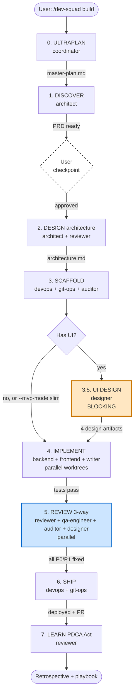
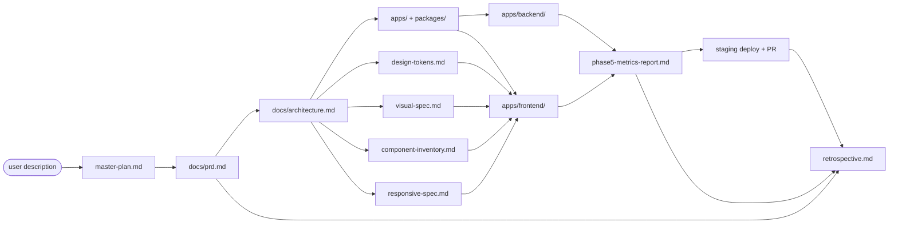

# Dev-Squad Workflow Mapping

> **Source of truth:** `.claude-plugin/workflows/*.json` — coordinator reads these JSONs at workflow start. This document is the human-readable view, manually synced.
> If JSON and this doc disagree, **the JSON wins**. Run `bash hooks/validate-workflow-schema.sh` to detect drift.

## Workflows

| Workflow | Trigger | Phases | When to use |
|---|---|---|---|
| **init** | `/dev-squad init` | 3 steps | Onboard existing project (architecture.md + tech-debt.md + gotchas.md + CLAUDE.md). Not a JSON workflow — runs directly from `commands/init.md`. |
| **zero-to-ship** | `/dev-squad build` | 9 | Full project from nothing -> shippable |
| **feature-development** | `/dev-squad feature` | 6 | Add feature to existing project |
| **bug-fix** | `/dev-squad fix` | 5 | Reproduce -> fix -> verify |
| **refactoring** | `/dev-squad refactor` | 7 | Restructure with before/after metrics |

---

## Zero-to-Ship: Master Table

| # | Phase | Lead Agent | Parallel | Inputs | Blocking Outputs | Skip | External Skills | Tier |
|---|---|---|---|---|---|---|---|---|
| 0 | ULTRAPLAN | coordinator | — | user description | `.dev-squad/master-plan.md` | — | superpowers:brainstorming, gsd-new-project | opus |
| 1 | DISCOVER | architect | — | master-plan.md | `docs/prd.md` | — | superpowers:brainstorming, gsd-discuss-phase | opus |
| 2 | DESIGN (Architecture) | architect | reviewer (threat model) | prd.md | `docs/architecture.md` | — | gsd-plan-phase, mermaid-mcp | opus |
| 3 | SCAFFOLD | devops | git-ops, auditor | architecture.md | `apps/`, `packages/` | — | — | sonnet |
| **3.5** | **UI DESIGN** | **designer** | — | prd.md, architecture.md | **4 design artifacts** | `--mvp-mode`, no UI | **ui-ux-pro-max**, frontend-design | sonnet |
| 4 | IMPLEMENT | coordinator | backend, frontend, writer | design artifacts | `apps/backend/`, `apps/frontend/` | — | gsd-execute-phase, superpowers:tdd | opus |
| 5 | REVIEW (3-way) | coordinator | reviewer, qa-engineer, auditor, designer | apps/ | `.dev-squad/phase5-metrics-report.md` | — | playwright, gsd-verify-work, gsd-secure-phase | sonnet |
| 6 | SHIP | devops | git-ops | phase5 report | staging deploy + PR | — | gsd-pr-branch, gsd-ship | sonnet |
| 7 | LEARN (PDCA Act) | reviewer | — | prd, phase5, gotchas | `.dev-squad/retrospective.md` | — | episodic-memory, claude-md | sonnet |

---

## Zero-to-Ship: Phase Flow Diagram



---

## Zero-to-Ship: Artifact Dependency Graph



---

## Zero-to-Ship: Skip Condition Decision Tree

```
Phase 3.5 UI DESIGN — when to skip?
├── --mvp-mode flag set?
│   ├── YES -> SLIM: produce design-tokens.md + slim visual-spec.md only (skip 2 of 4 artifacts)
│   └── NO  -> continue check
├── Backend-only feature (no UI)?
│   ├── YES -> SKIP entirely; designer not dispatched
│   └── NO  -> continue
└── Default: full Phase 3.5 with all 4 artifacts BLOCKING

Phase 5 lanes — which to dispatch?
└── Apply Diff-Scope Heuristic (see coordinator.md):
    ├── trivial (typo, comment) -> reviewer light pass only
    ├── tiny <50 LOC -> reviewer
    ├── new endpoint -> reviewer + auditor (Bucket C hammer)
    ├── new interactive UI -> reviewer + qa-engineer (Visual Gate)
    ├── new UI surface -> reviewer + qa-engineer + designer
    ├── DB / migration -> reviewer + auditor (Bucket B)
    ├── auth / payment -> full 3-way
    ├── refactor >=200 LOC -> reviewer + auditor (before/after) + qa-engineer
    └── default ambiguous -> full 3-way (lean toward MORE coverage)
```

---

## Feature Development: Master Table

| # | Phase | Lead Agent | Trigger | Skip Condition |
|---|---|---|---|---|
| 1 | Scope Assessment | coordinator | always | — |
| 2 | Architecture Review | architect | scope.tier in {new-endpoint, new-ui-surface, db-change, auth-change} | trivial/tiny/bug-fix |
| 2.5 | UI Design | designer | scope.has_ui && scope.tier == new-ui-surface | no UI, --mvp-mode (slim) |
| 3 | Implement | backend, frontend (parallel) | always | — |
| 4 | Review (Diff-Scope Heuristic) | reviewer + qa-engineer + auditor + designer (selective) | always | trivial -> reviewer-only |
| 5 | Deploy | devops + git-ops | always | — |

---

## Bug Fix: Master Table

| # | Phase | Lead Agent | Output |
|---|---|---|---|
| 1 | Reproduce + Root Cause | qa-engineer (Investigation Mode) | `.dev-squad/bug-investigation.md` |
| 2 | Severity Triage | coordinator | `.dev-squad/severity.json` |
| 3 | Implement Fix | backend OR frontend | fix commits + regression test |
| 4 | Verify + Regression | qa-engineer + reviewer (auditor if stability area) | verify report |
| 5 | Ship Fix | git-ops (hotfix branch if P0) | GitHub PR |

---

## Refactoring: Master Table

| # | Phase | Lead Agent | Key Output |
|---|---|---|---|
| 1 | Target Architecture | architect | `.dev-squad/refactor-target.md` |
| 2 | Baseline Metrics | auditor | `.dev-squad/refactor-baseline.md` |
| 2.5 | UI Design | designer (if visual change) | component update spec |
| 3 | Incremental Refactor | backend + frontend (parallel) | refactor commits |
| 4 | Smoke Verify per Batch | qa-engineer | smoke report |
| 5 | After Metrics | auditor | `.dev-squad/refactor-after.md` (vs baseline) |
| 6 | Review + Ship | reviewer + git-ops | staged PRs |

**Hard rule:** Refactor without measurable improvement = wasted effort. Auditor flags + escalates.

---

## Companion Plugin Matrix

| Plugin | Required? | Used in Phase | Used by | If not installed |
|---|---|---|---|---|
| **superpowers** | YES | All phases | All agents | Manual methodology (much weaker) |
| **ui-ux-pro-max** | recommended | 3.5 UI DESIGN | designer | Manual via WebSearch + frontend-design |
| **gsd** | recommended | 0, 1, 2, 4, 5, 6 | coordinator, architect, auditor, reviewer, git-ops | Native methodology in agent prompts |
| **frontend-design** | recommended | 3.5 UI DESIGN | designer, frontend | Manual via WebSearch references |
| **code-review** | recommended | 5 REVIEW | reviewer | Manual review |
| **playwright-skill** | recommended | 5 REVIEW (qa-engineer Phase 5.5) | qa-engineer | Manual smoke test |
| **superpowers-chrome** | recommended | 3.5 + 5 + bug-fix | designer, qa-engineer | Manual browser inspection |
| **episodic-memory** | recommended | 7 LEARN | coordinator | Per-session memory only |
| **claude-md-management** | recommended | 7 LEARN | coordinator | Manual CLAUDE.md updates |

### Companion MCPs

| MCP | Required? | Used in | Used by |
|---|---|---|---|
| **context7** | recommended | All phases for library docs | All agents |
| **sequential-thinking** | recommended | Complex decisions | coordinator, architect |
| **mermaid-mcp** | recommended | Phase 2 (C4 diagrams) | architect |
| **grep-github** | recommended | Phase 1, 2 (production patterns) | All agents |

Run `/dev-squad bootstrap` to auto-install MCPs and get plugin install commands.

---

## How to update this mapping

When you change a workflow:
1. **Edit the JSON** in `.claude-plugin/workflows/<workflow-id>.json` first.
2. Update affected agent prompts in `agents/*.md`.
3. **Update this file** to match the JSON.
4. Run `bash hooks/validate-workflow-schema.sh`.

When agent prompts and JSON disagree, JSON wins.
