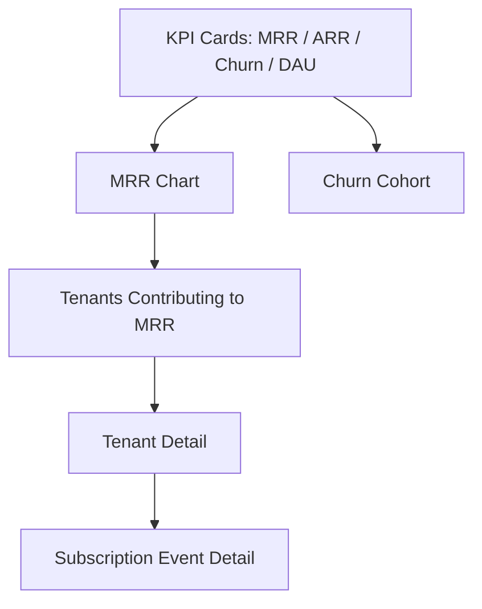

# Drill-Down Patterns — SaaS Dashboard Architecture for Dev Squad

## INSTRUCTIONS: When this skill is invoked

Load these patterns when frontend agent or designer is building a **drill-down dashboard** — a UI that lets the user start at a high-level KPI and progressively narrow to row-level detail. Common in admin panels, analytics, financial dashboards, and observability UIs.

**Critical rule:** A drill-down is not just nested pages. It's a **stateful exploration session** where every step must be:
1. Deep-linkable (sharing a URL re-creates the exact view)
2. Reversible (back button works correctly)
3. Filterable in composition (multiple filters across levels remain coherent)
4. Permission-aware (drill items hidden if user lacks entitlement)

If any of these breaks, drill-down becomes "click around and pray" — the worst kind of dashboard.

---

## 1. The Five Drill Levels

```
Level 1: KPI cards               (what's happening)
   ↓ click a metric
Level 2: Time-series chart        (when did it change)
   ↓ brush/zoom date range OR click a segment
Level 3: Segment table            (who/which contributes)
   ↓ click a row
Level 4: Entity detail            (what's the full picture for this row)
   ↓ click an activity
Level 5: Event detail              (what happened in this moment)
```

Not every dashboard needs all 5. But the pattern is consistent — each level narrows the dimension while preserving the previous filters.

### Example: SaaS revenue drill

| Level | View | Example URL |
|---|---|---|
| 1 | KPI: MRR $42k, ARR $504k, Churn 2.1% | `/admin/dashboard` |
| 2 | MRR over last 90 days, line chart | `/admin/dashboard/mrr?range=90d` |
| 3 | Top tenants contributing to MRR | `/admin/dashboard/mrr/tenants?range=90d&sort=mrr_desc` |
| 4 | Tenant "Acme Corp" detail page | `/admin/tenants/acme?range=90d&from_view=mrr` |
| 5 | Specific subscription change event | `/admin/tenants/acme/events/sub_chg_42?range=90d` |

The breadcrumb at level 5 reads: `Dashboard > MRR > Tenants > Acme > Subscription change`.

---

## 2. URL State Architecture

URL is the source of truth. Component state mirrors URL.

### 2.1 Search params schema (Zod-typed)

```typescript
// app/admin/dashboard/searchParams.ts
import { z } from 'zod';
import { useSearchParams } from 'next/navigation';

export const dashboardSearchSchema = z.object({
  range: z.enum(['7d', '30d', '90d', 'ytd', 'custom']).default('30d'),
  from: z.string().datetime().optional(),
  to: z.string().datetime().optional(),
  metric: z.enum(['mrr', 'arr', 'dau', 'mau', 'churn']).optional(),
  filter_plan: z.array(z.string()).default([]),
  filter_status: z.enum(['active', 'trial', 'cancelled', 'all']).default('all'),
  segment: z.string().optional(),
  sort: z.enum(['mrr_desc', 'mrr_asc', 'name_asc', 'created_desc']).default('mrr_desc'),
  cursor: z.string().optional(),
});

export type DashboardSearch = z.infer<typeof dashboardSearchSchema>;

export function useDashboardSearch(): [DashboardSearch, (next: Partial<DashboardSearch>) => void] {
  const params = useSearchParams();
  const router = useRouter();
  const pathname = usePathname();

  const current = useMemo(() => {
    const obj = Object.fromEntries(params);
    // arrays via repeated keys: ?filter_plan=pro&filter_plan=biz
    obj.filter_plan = params.getAll('filter_plan');
    return dashboardSearchSchema.parse(obj);
  }, [params]);

  const setSearch = useCallback((next: Partial<DashboardSearch>) => {
    const merged = { ...current, ...next };
    const sp = new URLSearchParams();
    for (const [k, v] of Object.entries(merged)) {
      if (v == null || v === '' || (Array.isArray(v) && v.length === 0)) continue;
      if (Array.isArray(v)) v.forEach(item => sp.append(k, item));
      else sp.set(k, String(v));
    }
    router.push(`${pathname}?${sp.toString()}`);
  }, [current, pathname, router]);

  return [current, setSearch];
}
```

**Why this matters:**
- Refresh = same view (no state lost)
- Share URL = same view for recipient
- Back button = previous filter state
- Browser history = exploration trail

### 2.2 Don't store transient UI in URL

URL is for **shareable state**: filters, sort, segment, cursor.
URL is NOT for: hover state, modal open/close, scroll position, ephemeral form input.

Rule of thumb: would you want this state in a Slack-shared screenshot URL? If yes → URL. If no → component state.

---

## 3. Breadcrumb with State Preservation

```typescript
// components/Breadcrumb.tsx
interface BreadcrumbStep {
  label: string;
  href: string;          // includes preserved search params
}

export function Breadcrumb({ steps }: { steps: BreadcrumbStep[] }) {
  return (
    <nav aria-label="Breadcrumb" className="flex items-center text-sm text-muted-foreground">
      {steps.map((step, i) => (
        <Fragment key={step.href}>
          {i > 0 && <ChevronRight className="mx-2 h-4 w-4" aria-hidden />}
          {i === steps.length - 1 ? (
            <span aria-current="page" className="text-foreground font-medium">{step.label}</span>
          ) : (
            <Link href={step.href} className="hover:text-foreground transition-colors">
              {step.label}
            </Link>
          )}
        </Fragment>
      ))}
    </nav>
  );
}
```

Build the trail in each route:

```typescript
// app/admin/dashboard/mrr/tenants/page.tsx
export default function MrrTenantsPage() {
  const [search] = useDashboardSearch();
  const range = search.range;

  const trail: BreadcrumbStep[] = [
    { label: 'Dashboard', href: '/admin/dashboard' },
    { label: 'MRR', href: `/admin/dashboard/mrr?range=${range}` },
    { label: 'Tenants', href: `/admin/dashboard/mrr/tenants?range=${range}&sort=${search.sort}` },
  ];

  return (
    <>
      <Breadcrumb steps={trail} />
      {/* ... */}
    </>
  );
}
```

**Critical:** every breadcrumb link must carry the relevant filters. Going back to "MRR" from level 3 should preserve the `range` so the user doesn't lose context.

---

## 4. Time-Series Charts with Brush + Zoom

Use a charting library that supports brush. Recommendations:
- **recharts** (good defaults, simple) — `<Brush>` component
- **visx** (composable, low-level) — full control, steeper learning
- **nivo** (opinionated, good for non-interactive)

### 4.1 Brush-driven date range update

```tsx
// components/MrrChart.tsx
import { LineChart, Line, XAxis, YAxis, Tooltip, Brush, ResponsiveContainer } from 'recharts';

export function MrrChart({ data, onRangeChange }: { data: TimeSeriesPoint[]; onRangeChange: (from: Date, to: Date) => void }) {
  return (
    <ResponsiveContainer width="100%" height={400}>
      <LineChart data={data} margin={{ top: 20, right: 16, bottom: 20, left: 0 }}>
        <XAxis dataKey="timestamp" tickFormatter={(ts) => format(new Date(ts), 'MMM d')} />
        <YAxis tickFormatter={(v) => `$${(v / 1000).toFixed(0)}k`} />
        <Tooltip formatter={(v: number) => `$${v.toLocaleString()}`} />
        <Line type="monotone" dataKey="value" stroke="hsl(var(--primary))" strokeWidth={2} dot={false} />
        <Brush
          dataKey="timestamp"
          height={30}
          stroke="hsl(var(--primary))"
          tickFormatter={(ts) => format(new Date(ts), 'MMM')}
          onChange={(range) => {
            if (range?.startIndex != null && range?.endIndex != null) {
              const from = new Date(data[range.startIndex].timestamp);
              const to = new Date(data[range.endIndex].timestamp);
              onRangeChange(from, to);
            }
          }}
        />
      </LineChart>
    </ResponsiveContainer>
  );
}
```

`onRangeChange` updates URL state which re-fetches data at the new range. Debounce by 300ms to avoid hammering the API while user is dragging.

### 4.2 Granularity auto-selection

Backend response should include `granularity` chosen for the requested range. Rule of thumb:

| Range | Granularity | Points |
|---|---|---|
| < 24h | 5min | ~288 |
| 1-7 days | hour | 24-168 |
| 7-90 days | day | 7-90 |
| > 90 days | week | 13+ |
| > 1 year | month | 12+ |

Aim for 50-300 points per chart — fewer = blurry, more = noisy.

---

## 5. Virtualized Tables (Large Datasets)

Default `<table>` choke at ~500 rows. Virtualization renders only visible rows.

### 5.1 TanStack Virtual + TanStack Table

```bash
pnpm add @tanstack/react-table @tanstack/react-virtual
```

```tsx
// components/VirtualTable.tsx
import { useVirtualizer } from '@tanstack/react-virtual';
import { useReactTable, getCoreRowModel, flexRender, type ColumnDef } from '@tanstack/react-table';

export function VirtualTable<T>({ data, columns }: { data: T[]; columns: ColumnDef<T>[] }) {
  const parentRef = useRef<HTMLDivElement>(null);

  const table = useReactTable({ data, columns, getCoreRowModel: getCoreRowModel() });
  const { rows } = table.getRowModel();

  const rowVirtualizer = useVirtualizer({
    count: rows.length,
    getScrollElement: () => parentRef.current,
    estimateSize: () => 48,
    overscan: 8,
  });

  return (
    <div ref={parentRef} className="h-[600px] overflow-auto rounded-md border">
      <table className="w-full">
        <thead className="sticky top-0 bg-background z-10">
          {table.getHeaderGroups().map(hg => (
            <tr key={hg.id}>
              {hg.headers.map(h => (
                <th key={h.id} className="px-4 py-2 text-left">
                  {flexRender(h.column.columnDef.header, h.getContext())}
                </th>
              ))}
            </tr>
          ))}
        </thead>
        <tbody style={{ height: `${rowVirtualizer.getTotalSize()}px`, position: 'relative' }}>
          {rowVirtualizer.getVirtualItems().map(vRow => {
            const row = rows[vRow.index];
            return (
              <tr
                key={row.id}
                style={{
                  position: 'absolute',
                  top: 0,
                  left: 0,
                  width: '100%',
                  height: `${vRow.size}px`,
                  transform: `translateY(${vRow.start}px)`,
                }}
                className="hover:bg-muted/50 cursor-pointer"
              >
                {row.getVisibleCells().map(cell => (
                  <td key={cell.id} className="px-4 py-2">
                    {flexRender(cell.column.columnDef.cell, cell.getContext())}
                  </td>
                ))}
              </tr>
            );
          })}
        </tbody>
      </table>
    </div>
  );
}
```

### 5.2 Server-side pagination + infinite scroll

For 10k+ rows, virtualization isn't enough — you can't load everything client-side. Use cursor-based pagination + auto-fetch on scroll:

```tsx
const { data, fetchNextPage, hasNextPage, isFetchingNextPage } = useInfiniteQuery({
  queryKey: ['tenants', filters],
  queryFn: ({ pageParam }) => api.getTenants({ ...filters, cursor: pageParam }),
  getNextPageParam: (last) => last.pagination.cursor,
  initialPageParam: undefined,
});

const allRows = data?.pages.flatMap(p => p.data) ?? [];

const rowVirtualizer = useVirtualizer({
  count: hasNextPage ? allRows.length + 1 : allRows.length,
  ...
});

// In the row render:
useEffect(() => {
  const lastItem = [...rowVirtualizer.getVirtualItems()].at(-1);
  if (!lastItem) return;
  if (lastItem.index >= allRows.length - 1 && hasNextPage && !isFetchingNextPage) {
    fetchNextPage();
  }
}, [rowVirtualizer.getVirtualItems(), allRows.length, hasNextPage, isFetchingNextPage]);
```

Render a loading row at the bottom when fetching next page.

---

## 6. Cross-Filter Coordination

When filters span multiple components (date range affects chart AND table AND KPI cards), centralize the filter state.

### 6.1 Filter store (Zustand)

```typescript
// stores/dashboardFilters.ts
import { create } from 'zustand';
import { subscribeWithSelector } from 'zustand/middleware';

interface FilterState {
  range: '7d' | '30d' | '90d' | 'custom';
  customFrom?: Date;
  customTo?: Date;
  plans: string[];
  status: 'all' | 'active' | 'trial' | 'cancelled';
  segment?: string;

  setRange: (range: FilterState['range']) => void;
  setCustomDates: (from: Date, to: Date) => void;
  togglePlan: (slug: string) => void;
  setStatus: (status: FilterState['status']) => void;
  setSegment: (segment: string | undefined) => void;
  reset: () => void;
}

export const useDashboardFilters = create<FilterState>()(
  subscribeWithSelector((set) => ({
    range: '30d',
    plans: [],
    status: 'all',

    setRange: (range) => set({ range, customFrom: undefined, customTo: undefined }),
    setCustomDates: (from, to) => set({ range: 'custom', customFrom: from, customTo: to }),
    togglePlan: (slug) => set((s) => ({
      plans: s.plans.includes(slug) ? s.plans.filter(p => p !== slug) : [...s.plans, slug],
    })),
    setStatus: (status) => set({ status }),
    setSegment: (segment) => set({ segment }),
    reset: () => set({ range: '30d', plans: [], status: 'all', segment: undefined, customFrom: undefined, customTo: undefined }),
  }))
);
```

### 6.2 Bridge filter store ↔ URL

```typescript
// hooks/useDashboardFiltersUrl.ts
export function useDashboardFiltersUrl() {
  const filters = useDashboardFilters();
  const [urlSearch, setUrlSearch] = useDashboardSearch();

  // URL → store (on mount + url change)
  useEffect(() => {
    useDashboardFilters.setState({
      range: urlSearch.range,
      plans: urlSearch.filter_plan,
      status: urlSearch.filter_status,
      segment: urlSearch.segment,
    });
  }, [urlSearch.range, urlSearch.filter_plan, urlSearch.filter_status, urlSearch.segment]);

  // store → URL (on filter change)
  useEffect(() => {
    return useDashboardFilters.subscribe(
      (s) => ({ range: s.range, plans: s.plans, status: s.status, segment: s.segment }),
      (next) => setUrlSearch({
        range: next.range,
        filter_plan: next.plans,
        filter_status: next.status,
        segment: next.segment,
      }),
      { equalityFn: (a, b) => JSON.stringify(a) === JSON.stringify(b) }
    );
  }, [setUrlSearch]);
}
```

Component code stays clean:

```tsx
const filters = useDashboardFilters();
const { data } = useQuery({
  queryKey: ['mrr', filters.range, filters.plans, filters.status],
  queryFn: () => api.getMrr({ range: filters.range, plans: filters.plans, status: filters.status }),
});
```

When user changes filter → store updates → URL updates → query refetches with new key.

---

## 7. Empty / Loading / Error States Per Drill Level

Each level needs all 4 states:

| State | Treatment |
|---|---|
| **Loading** | Skeleton shaped like the real content, NOT a spinner. Spinner = "I have no idea what's coming." Skeleton = "data shape preview." |
| **Empty** | Friendly copy + suggested next action. NOT "no data." |
| **Error** | Specific error class + recovery action (retry button). NOT "something went wrong." |
| **Loaded** | Data render + cache invalidation hooks |

### 7.1 Skeleton matching the layout

```tsx
// Level 1 KPI cards skeleton
function KpiCardsSkeleton() {
  return (
    <div className="grid grid-cols-1 sm:grid-cols-2 lg:grid-cols-4 gap-4">
      {[1, 2, 3, 4].map(i => (
        <div key={i} className="rounded-lg border p-4">
          <div className="h-4 w-24 bg-muted animate-pulse rounded" />
          <div className="mt-2 h-8 w-32 bg-muted animate-pulse rounded" />
          <div className="mt-1 h-3 w-20 bg-muted animate-pulse rounded" />
        </div>
      ))}
    </div>
  );
}
```

The skeleton matches dimensions and grid of the loaded version. No layout shift on transition.

### 7.2 Empty with action

```tsx
function EmptyState({ icon: Icon, title, description, action }: EmptyStateProps) {
  return (
    <div className="flex flex-col items-center justify-center py-16 text-center">
      <Icon className="h-12 w-12 text-muted-foreground mb-4" />
      <h3 className="text-lg font-medium">{title}</h3>
      <p className="text-sm text-muted-foreground mt-1 max-w-md">{description}</p>
      {action && <div className="mt-6">{action}</div>}
    </div>
  );
}

// usage:
<EmptyState
  icon={SearchX}
  title="No tenants match these filters"
  description="Try widening the date range or removing plan filters."
  action={<Button variant="outline" onClick={resetFilters}>Reset filters</Button>}
/>
```

### 7.3 Error with class-specific copy

```tsx
function ErrorState({ error, retry }: { error: ApiError; retry: () => void }) {
  if (error.code === 'ENTITLEMENT_REQUIRED') {
    return (
      <UpgradePrompt feature={error.requiredFeature} currentPlan={error.currentPlan} />
    );
  }
  if (error.code === 'TENANT_ACCESS_DENIED') {
    return (
      <EmptyState
        icon={Lock}
        title="Access denied"
        description="You don't have permission to view this resource. Contact your tenant admin."
      />
    );
  }
  return (
    <EmptyState
      icon={AlertTriangle}
      title="Couldn't load data"
      description={error.message}
      action={<Button onClick={retry}>Try again</Button>}
    />
  );
}
```

---

## 8. Permission-Aware Drill Items

Some drill targets require entitlement. Hide rather than show-then-block.

```tsx
// Wrap permission-gated UI
function PermissionGate({ feature, fallback, children }: {
  feature: string;
  fallback?: ReactNode;
  children: ReactNode;
}) {
  const tenant = useCurrentTenant();
  const allowed = useEntitlement(tenant, feature);
  if (!allowed) return fallback ?? null;
  return <>{children}</>;
}

// usage in KPI cards:
<KpiCard label="MRR" value={mrr.value} change={mrr.change} />
<PermissionGate feature="metrics.advanced">
  <KpiCard label="LTV/CAC" value={ltv.cacRatio} change={ltv.change} />
</PermissionGate>
```

For drill links:

```tsx
<PermissionGate
  feature="metrics.export"
  fallback={
    <Tooltip content="Upgrade to Pro to export">
      <Button variant="outline" disabled>
        <Download /> Export <Lock className="ml-2 h-3 w-3" />
      </Button>
    </Tooltip>
  }
>
  <Button onClick={handleExport}>
    <Download /> Export
  </Button>
</PermissionGate>
```

Show the locked state for discoverability — don't make the feature invisible, make it visibly gated.

---

## 9. Real-Time Updates

For dashboards that should update without refresh:

### 9.1 Polling (simplest, fits most cases)

```tsx
const { data } = useQuery({
  queryKey: ['dashboard-summary'],
  queryFn: api.getDashboardSummary,
  refetchInterval: 30_000,             // 30s
  refetchOnWindowFocus: true,
});
```

### 9.2 Server-Sent Events (efficient one-way)

```tsx
useEffect(() => {
  const es = new EventSource(`/api/v1/dashboard/stream?token=${token}`);
  es.onmessage = (e) => {
    const update = JSON.parse(e.data);
    queryClient.setQueryData(['dashboard-summary'], (old) => ({ ...old, ...update }));
  };
  return () => es.close();
}, []);
```

### 9.3 WebSocket (bidirectional, for collab dashboards)

Use only when you need bidirectional events (live cursor, comments, multi-user filter sync). Otherwise polling/SSE is simpler.

**Indicator pattern:** show "last updated 12s ago" timestamp. Users trust freshness signals more than implicit "real-time" claims.

---

## 10. Performance Considerations

### 10.1 Bundle splitting per drill level

Each drill level is a separate route → automatic code splitting in Next.js App Router. Keep level-specific heavy deps (charts, virtualization) in level components, not in the layout.

### 10.2 Memoize derived data

```tsx
const sortedRows = useMemo(
  () => [...rows].sort((a, b) => sortKey === 'mrr_desc' ? b.mrr - a.mrr : a.mrr - b.mrr),
  [rows, sortKey]
);
```

For 10k+ rows, sort/filter on the server. Client-side derivations are for ≤1k rows.

### 10.3 React Query stale time

```tsx
const { data } = useQuery({
  queryKey: ['mrr-chart', filters],
  queryFn: () => api.getMrrChart(filters),
  staleTime: 60_000,                      // chart data stable for 1 min
  gcTime: 5 * 60_000,                     // keep in cache 5 min after unmount
});
```

Different levels need different stale times:
- Real-time KPIs: 0-30s
- Time-series charts: 60s-5min
- Historical detail: 5min-1h
- Audit log: should NOT be cached aggressively (compliance)

### 10.4 Suspense boundaries per level

```tsx
<Suspense fallback={<KpiCardsSkeleton />}>
  <KpiCards />
</Suspense>
<Suspense fallback={<ChartSkeleton />}>
  <MrrChart />
</Suspense>
<Suspense fallback={<TableSkeleton />}>
  <TenantsTable />
</Suspense>
```

Each section streams independently. Slow chart doesn't block fast KPI cards.

### 10.5 Optimistic UI for mutations

When user toggles a filter or clicks "mark all read":

```tsx
const mutation = useMutation({
  mutationFn: api.markAllNotificationsRead,
  onMutate: async () => {
    await queryClient.cancelQueries({ queryKey: ['notifications'] });
    const previous = queryClient.getQueryData(['notifications']);
    queryClient.setQueryData(['notifications'], (old) =>
      old.map(n => ({ ...n, readAt: new Date() }))
    );
    return { previous };
  },
  onError: (err, _, context) => {
    queryClient.setQueryData(['notifications'], context?.previous);
    toast.error('Could not mark all as read');
  },
  onSettled: () => queryClient.invalidateQueries({ queryKey: ['notifications'] }),
});
```

UI updates instantly; rollback only if API fails.

---

## 11. Designer's Drill-Down Spec (Phase 3.5 output)

Designer must produce this artifact when project has dashboard with drill-down:

```markdown
# Drill-Down Spec

## Drill Hierarchy



## Per-Level Specification

### Level 1: KPI Cards
- Layout: 4-column grid desktop / 2-col tablet / 1-col mobile
- Card content: metric name, value, % change vs previous period, sparkline
- Empty state: "Awaiting first data" + ETA
- Interaction: click → level 2

### Level 2: Time-Series Chart
- Default range: 30d
- Range presets: 7d / 30d / 90d / YTD / custom
- Brush enabled at bottom — drag to zoom
- Tooltip on hover shows exact value + date
- Interaction: click point → level 3 with that day pre-selected

### Level 3: Segment Table
- Default sort: contribution to metric, desc
- Columns: name, value, % share, change, last activity
- Sortable headers
- Filter chips above table
- Row count badge
- Pagination: cursor-based, infinite scroll
- Interaction: click row → level 4

### Level 4: Entity Detail
- Layout: 2-column — summary panel left, activity feed right
- Summary panel: key facts + actions (edit / suspend / impersonate)
- Activity feed: scrollable, grouped by date
- Tabs for sub-views (overview / billing / members / api-keys)
- Interaction: click activity item → level 5

### Level 5: Event Detail
- Modal or side sheet (don't break navigation)
- Full event payload + before/after diff
- Actions: copy as cURL / open in admin / view audit trail

## Filter Model
- range: time window
- plans: multi-select chips
- status: tab pill (all / active / trial / cancelled)
- search: text input (name / email)

All filters compose. Every level respects all active filters.

## Anti-Patterns (Visual Gate input for qa-engineer)
- Spinner instead of skeleton ❌
- Empty table with no message ❌
- Generic "error" with no recovery ❌
- Drill link that loses filter state ❌
- Modal that blocks back-button ❌
- Click target < 44px on mobile ❌
- No keyboard navigation for drill ❌
```

This spec feeds:
- frontend agent: implementation
- qa-engineer Visual Gate: verification
- writer agent: empty/loading/error copy

---

## Companion skills

When this skill is loaded, also reference:
- `dev-squad:saas-patterns` for the backend admin endpoints feeding these drill levels
- `dev-squad:frontend-patterns` for component composition, hooks, state management baseline
- `frontend-design:frontend-design` (if installed) for visual aesthetic of drill levels

## Bootstrap Context

Designer (Phase 3.5) MUST produce drill-down spec BEFORE frontend codes. Without explicit drill spec, frontend will improvise — usually skipping breadcrumb state preservation, virtualization, or permission gating.

For any project where PRD mentions "dashboard", "analytics", "metrics", "admin panel", or "drill down" — this skill activates automatically via coordinator.
